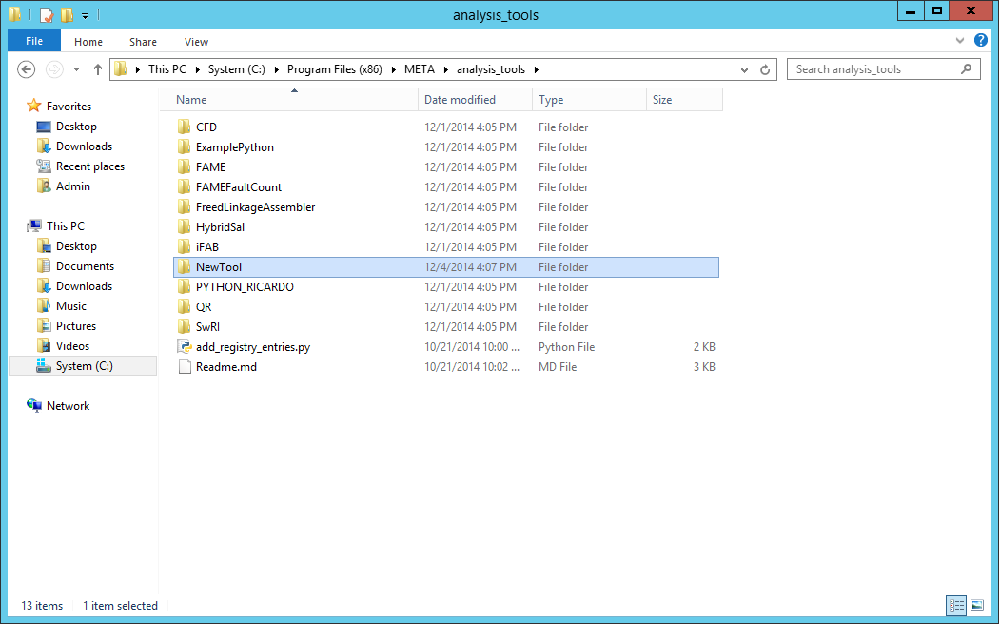
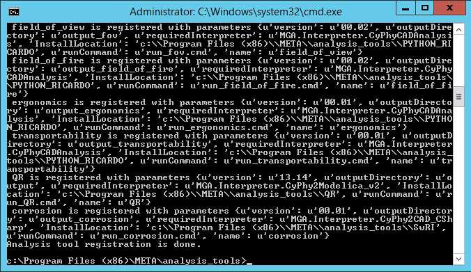
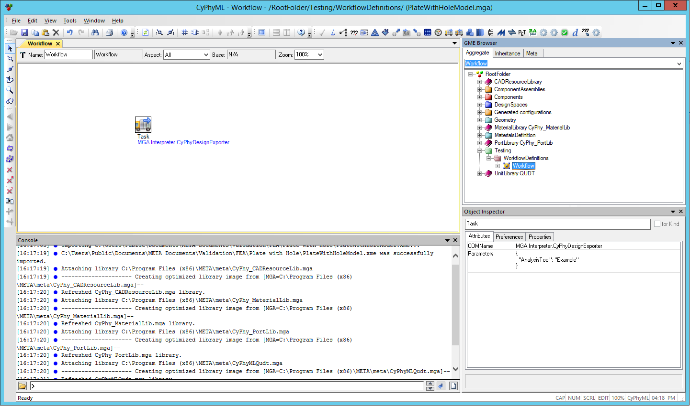
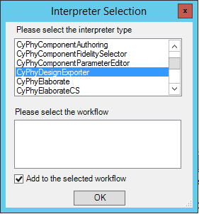
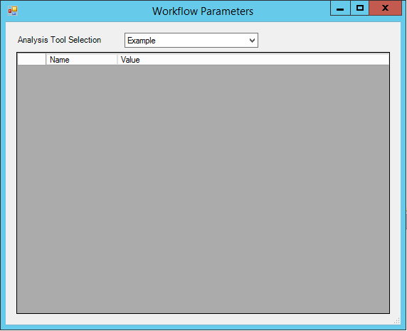
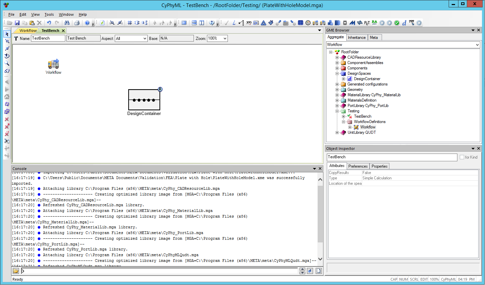
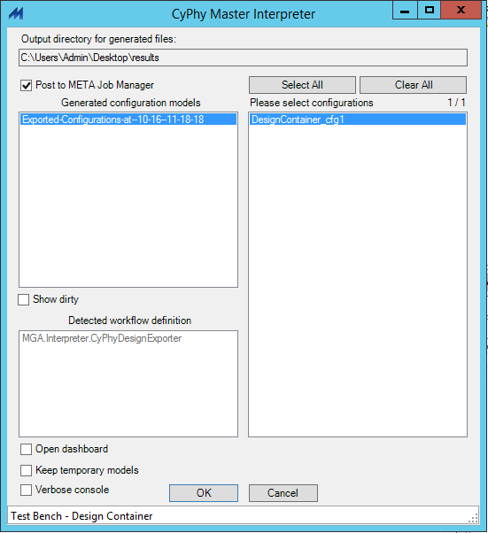
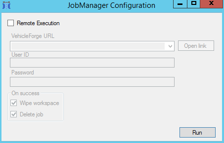
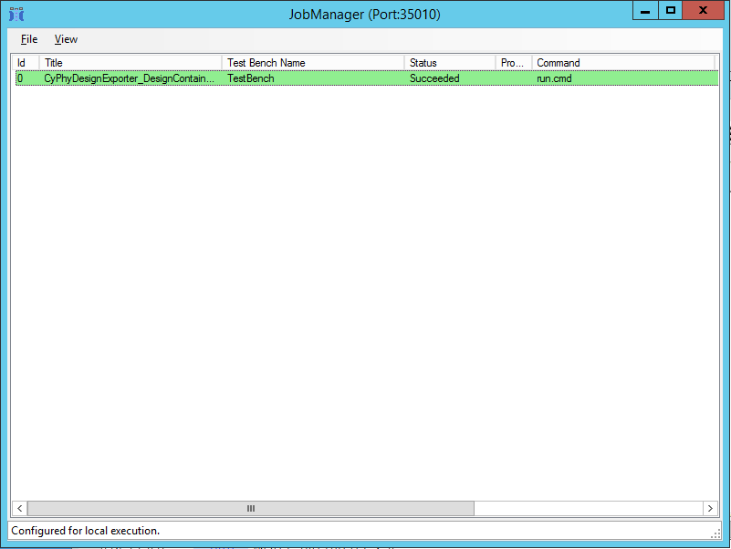

<!---
See analysis_tool.pdf for formatted documentation.
-->

# Analysis Tools #

Analysis tools are run as part of a CyPhy test bench. Each tool defines
which artifacts should be extracted from the CyPhy model and what the 
entry point of the tool is. To add a new analysis tool follow the instructions below.

## 1. Create Directory ##
Create a new directory at `META tool install location\analysis_tools`, e.g. `C:\Program Files (x86)\META\analysis_tools` and name it appropriately.

\newpage

## 2. Create `analysis_tool.manifest.json` ##
Add `analysis_tool.manifest.json` inside the created folder, see Figure 2. An example can be found at:

`META tool install location\analysis_tools\ExamplePython\analysis_tool.manifest.json`.

Note: one directory can contain multiple analysis tools.

\newpage

## 3. Configure `analysis_tool.manifest.json` ##
Change the values accordingly to your needs in your `analysis_tool.manifest.json` file.

1. `key` - name of your tool
2. `version` - version number of your tool
3. `outputDirectory` - content of this directory will be copied to __every__ test bench output directory where your tool is selected as the analysis tool. Note: this could override some generated artifacts, pick file names carefully.
4. `runCommand` - main entry point to your tool. It is _strongly_ recommended that you use a batch file and then call python/java or other tools, see Figure 4 and 5. (For failed executions exit with error code != 0.) 
5. `requiredInterpreter` - defines the ProgID of the interpreter that has to generate the input artifacts for your analysis tool. Examples
	1. `MGA.Interpreter.CyPhy2CAD_CSharp` - Generates input files for CAD processing (Assembly, FEA, CFD, Thermal, Kinematic, etc.)
	2. `MGA.Interpreter.CyPhyCADAnalysis` - Generates CAD files.
	3. `MGA.Interpreter.CyPhy2Modelica_v2` - Generates composed Modelica models.
	4. `MGA.Interpreter.CyPhyDesignExporter` - Generates an ADM (xml) file describing the design.

Note: For more than one analysis tool add an extra key-value pair.

\newpage

## 4. Register tools ##
Register all tools by running the `add_registry_entries.py` script from the META Python virtual environment as an administrator: `..\bin\Python27\Scripts\python.exe add_registry_entries.py`.

If it runs successfully then `Analysis tool registration is done.` is the last message in the console.

\newpage

## 5. Reference analysis tool from CyPhy (GME) ##
Create a `Workflow`, see Figure 8. 
Add `Task` and select the interpreter (as defined by `requiredInterpreter`), see Figure 9. 

Double click on the `Task` object in the `Workflow` definition and select your tool from the drop down list, see Figure 10.

\newpage

## 6. Executing Test Bench ##
Create a reference to the `Workflow` from a `Test Bench`, see Figure 11.

Run the test bench using the `MasterInterpreter` and the `JobManager` configured for local execution, see Figure 12 and 13. 

While existing with error code 0 the result will be reported as `Succeeded`, see Figure 14.

